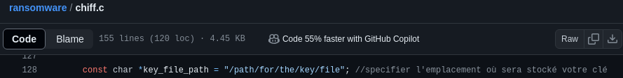

# Programme de chiffrement
Le fichier chiff.c chiffre des fichiers d'un répertoire spécifié en utilisant AES-256 CBC, sauvegarde la clé de chiffrement dans un emplacement defini sur le système de l'utilisateur et affiche une interface graphique à la fin du processus pour prevenir votre victime.
 
## Bibliothèques Utilisées
OpenSSL (**<openssl/evp.h>, <openssl/err.h>, <openssl/rand.h>**) : Utilisées pour effectuer le chiffrement AES-256, la gestion des erreurs OpenSSL, et la génération de nombres aléatoires pour la clé et le vecteur d'initialisation (IV).
Standard C (**<stdio.h>, <stdlib.h>, <string.h>**) : Fournissent des fonctionnalités pour les entrées/sorties, la gestion de la mémoire, et les manipulations de chaînes.
Système de fichiers (**<dirent.h>, <sys/stat.h>, <unistd.h>**) : Permettent de parcourir les répertoires, d'obtenir les informations sur les fichiers, et d'effectuer des opérations spécifiques au système comme ajuster la taille d'un fichier.
GTK+ (**<gtk/gtk.h>**) : Utilisée pour créer l'interface graphique affichant un message après le processus de chiffrement.

## Fonctions Principales
**handleErrors()** : Imprime les erreurs OpenSSL sur stderr et arrête l'exécution du programme.
**encrypt_file_in_place()** : Chiffre un fichier en place, en utilisant la clé et le vecteur d'initialisation générés aléatoirement. Le contenu chiffré remplace le contenu original du fichier.
**encrypt_directory_in_place()** : Parcourt récursivement le répertoire spécifié et chiffre chaque fichier trouvé en utilisant la fonction *encrypt_file_in_place()*.
**show_encrypted_message_with_image()** : Initialise GTK+, crée une fenêtre contenant un message qui sera affiché à la victime.
**main()** : Point d'entrée principal du programme. Génère une clé de chiffrement aléatoire, sauvegarde cette clé dans un fichier, puis appelle *encrypt_directory_in_place* pour chiffrer le contenu du répertoire spécifié en utilisant la fonction *encrypt_file_in_place()*. Enfin, affiche une interface graphique avec un message.

## Compilation et Exécution
Pour compiler ce programme, nous aurons besoin des bibliothèques de développement pour OpenSSL et GTK+ tout en verifiant avant que OpenSSL est bien installé.

**Installation de Openssl et ses bibliothèques de développement.**
On verifie d'abord si OpenSSL est bien installé sur notre machine à l'aide de la commande suivante :

```openssl version```

Si non on peut l'installer en même que ses bibliothèques de développement avec les commandes ci-dessous.

```sudo apt-get update```
```sudo apt-get install openssl libssl-dev```

/!\ N'oublions pas de changer le nom et l'emplacement où sera stocké notre clé dans le code
    *Exemple : /home/me/key.txt*


**Installation de GTK+ .**
On verifie d'abord si GTK+ est bien installé sur notre machine à l'aide de la commande suivante :

```pkg-config --modversion gtk+-3.0```

Si non on peut l'installer les commandes ci-dessous.

```sudo apt-get update```
```sudo apt install libgtk-3-dev```

Et pour compiler le programme nous utiliserons la commande suivante avec chiff comme nom de fichier et nom de l'executable:
 
```gcc chiff.c -o chiff  `pkg-config --cflags --libs gtk+-3.0` -lssl -lcrypto```

Pour exécuter le programme nous utiliserons la commande ci-dessous :
 
```./chiff <chemin_du_répertoire_à_chiffrer>```

Nous remplacerons <chemin_du_répertoire_à_chiffrer> par le chemin du répertoire dont nous souhaitons chiffrer le contenu. Le programme générera une clé de chiffrement, et la sauvegardera dans le chemin spécifié dans le code, chiffrera tous les fichiers du répertoire indiqué et ses sous répertoires.


# Programme de déchiffrement
Le fichier **dechiff.c** permet de déchiffrer les fichiers d'un répertoire spécifié, précédemment chiffrés avec l'algorithme **AES-256**.
 
## Bibliothèques Utilisées
**<openssl/evp.h>**, **<openssl/err.h>**, **<openssl/rand.h>**: Elles font partie de la bibliothèque OpenSSL et sont utilisées pour les opérations de chiffrement/déchiffrement, la gestion des erreurs, et la génération de clés aléatoires, respectivement.
**<stdio.h>**, **<stdlib.h>**, **<string.h>**: Elles fournissent des fonctionnalités standard de C pour la manipulation de fichiers, l'allocation de mémoire, et les opérations sur les chaînes de caractères.
**<dirent.h>**: Elle permet la geston et la manipulation des répertoires.
**<sys/stat.h>**: Elle permet d'obtenir des informations sur les fichiers tels que leur type (fichier ou répertoire).
**<unistd.h>**: Elle fournit l'accès à l'API POSIX pour les appels système, comme ftruncate pour ajuster la taille d'un fichier.

## Fonctions Principales
**handleErrors()**: Imprime les erreurs OpenSSL sur stderr et arrête l'exécution du programme.
**decrypt_file_in_place()**: Déchiffre un fichier en place. Cette fonction lit l'IV du début du fichier, déchiffre le contenu avec AES-256 CBC en utilisant la clé fournie, puis réécrit le contenu déchiffré dans le même fichier.
**decrypt_directory_in_place()**: Parcourt récursivement un répertoire et déchiffre tous les fichiers contenus. Elle ignore les répertoires spéciaux . et ...
**main()**: Point d'entrée du programme. Vérifie les arguments passés au programme, lit la clé de déchiffrement depuis un fichier spécifié, puis déchiffre récursivement les fichiers du répertoire fourni.

## Compilation et Exécution
Afin de compiler notre programme, nous devrions avoir les bibliothèques de développement pour OpenSSL installées sur notre système. 
**Installation de Openssl et ses bibliothèques de développement.**
On verifie d'abord si OpenSSL est bien installé sur notre machine à l'aide de la commande suivante :

```openssl version```

Si non on peut l'installer en même que ses bibliothèques de développement avec les commandes ci-dessous.

```sudo apt-get update```
```sudo apt-get install openssl libssl-dev```

Et pour compiler le programme nous utiliserons la commande suivante avec dechiff comme nom de fichier et nom de l'executable:
 
```gcc dechiff.c -o dechiff -lssl -lcrypto```

Pour exécuter le programme, nous devons utiliser la commande suivante, en remplaçant <répertoire_à_déchiffrer> par le chemin du répertoire contenant les fichiers chiffrés et <clé> par le chemin vers le fichier contenant la clé de déchiffrement :
 
```./dechiff <répertoire_à_déchiffrer> <clé>```